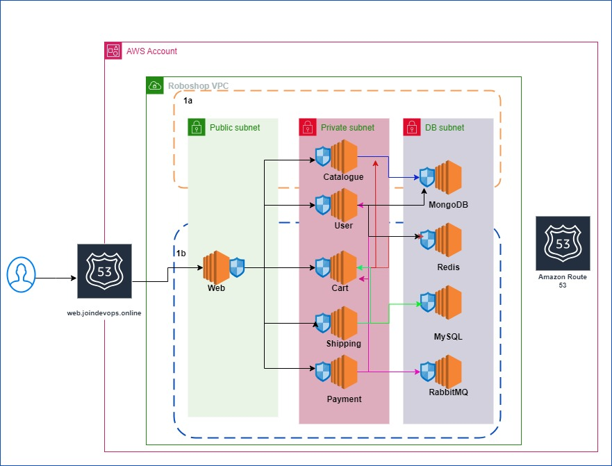

### Roboshop Infrastructure

We require following things.
* AWS Account
* Entire infra should be in us-east-1 region.
* We selected us-east-1a and us-east-1b for HA.
* Create VPC with CIDR 10.0.0.0/16.
* Internet Gateway
* 2 Public Subnets
* 2 Private Subnets
* 2 DB subnets
* NAT Gateway
* EIP
* Security Groups
* R53 records
* EC2 instances

#### Firewalls

**Web**: 
Ingress: Web instance should accept traffic from internet(0.0.0.0/0) on port no 80.  

**User**: 
Ingress: User instance should accept traffic from
* Web instance on port 8080
* Payment instance on port 8080 

**Cart:** 
Ingress: Cart instance should accept traffic from
* Web instance on port 8080
* Shipping instance on port 8080
* Payment instance on port 8080 

**Shipping:** 
Ingress: Shipping instance should accept traffic from
* Web instance on port 8080 

**Payment:** 
Ingress: Payment instance should accept traffic from
* Web instance on port 8080<br\>

**MongoDB:** 
Ingress: MongoDB instance should accept traffic from
* Catalogue instance on port no 27017
* User instance on port no 27017 

**Redis:** 
Ingress: Redis instance should accept traffic from
* User instance on port 6379
* Cart instance on port 6379 

**MySQL:** 
Ingress: MySQL instance should accept traffic from
* Shipping instance on port 3306.  

**RabbitMQ:** 
Ingress: RabbitMQ instance should accept traffic from
* Payment instance on port 5372. 

